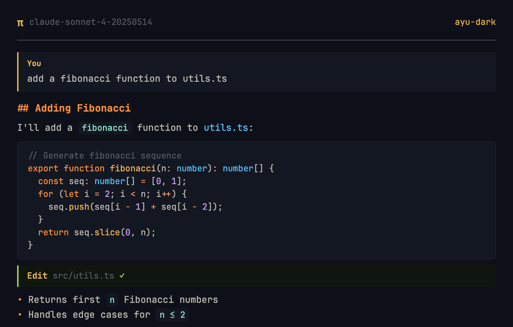
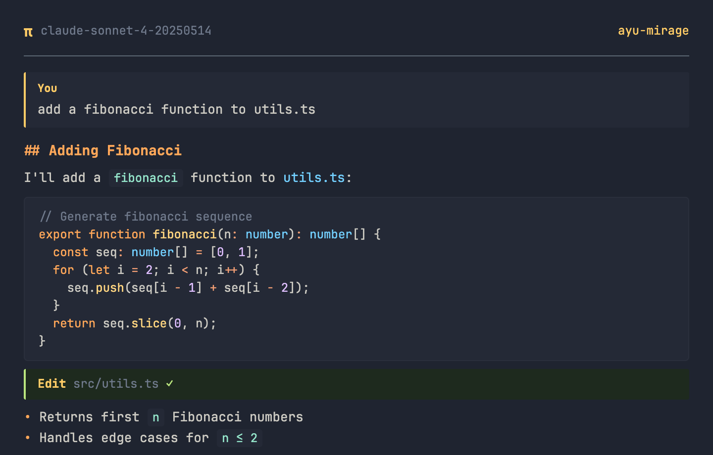
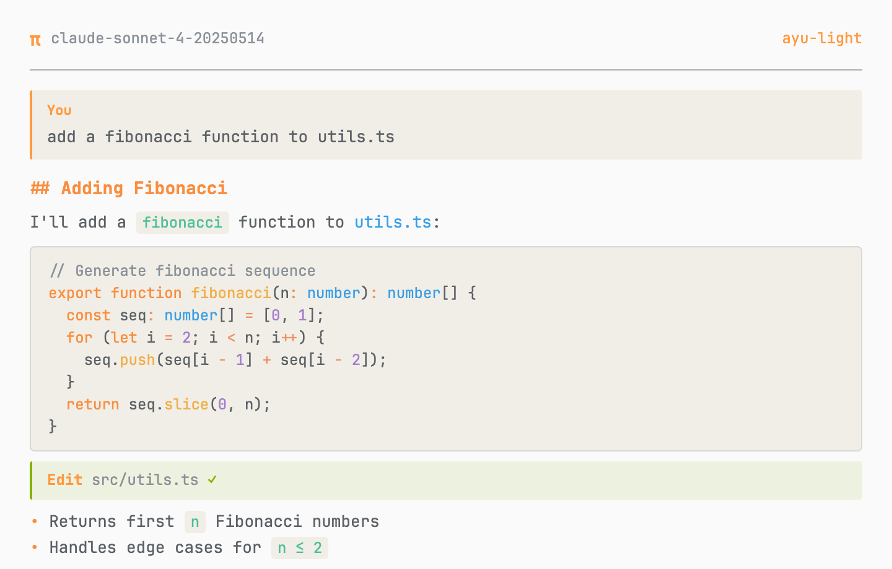

# Ayu Themes for pi

[Ayu](https://github.com/ayu-theme/ayu-colors) color themes for [pi](https://github.com/badlogic/pi-mono) — all three variants: **dark**, **mirage**, and **light**.

## Previews

### Dark


### Mirage


### Light


## Themes

| Theme | Background | Accent | Description |
|-------|-----------|--------|-------------|
| `ayu-dark` | `#0D1017` | `#E6B450` | Dark variant — deep blue-black |
| `ayu-mirage` | `#1F2430` | `#FFCC66` | Mirage variant — soft dark blue |
| `ayu-light` | `#FAFAFA` | `#FF9940` | Light variant — warm white |

## Install

### As a pi package (recommended)

```bash
pi install git:github.com/iodic/pi-ayu-themes
```

Or add to `~/.pi/agent/settings.json`:

```json
{
  "packages": ["git:github.com/iodic/pi-ayu-themes"]
}
```

### Manual

```bash
./install.sh
```

Then select a theme via `/settings` in pi.

## Auto theme switching

Pair with [pi-auto-theme](https://github.com/iodic/pi-auto-theme) to automatically switch between light and dark themes based on macOS system appearance.

## Color Reference

Colors sourced from [ayu-colors](https://github.com/ayu-theme/ayu-colors):

| Role | Dark | Mirage | Light |
|------|------|--------|-------|
| Keywords | `#FF8F40` | `#FFA759` | `#FA8D3E` |
| Functions | `#FFB454` | `#FFD580` | `#F2AE49` |
| Strings | `#AAD94C` | `#BAE67E` | `#86B300` |
| Types | `#59C2FF` | `#73D0FF` | `#399EE6` |
| Constants | `#D2A6FF` | `#DFBFFF` | `#A37ACC` |
| Operators | `#F29668` | `#F29E74` | `#ED9366` |
| Errors | `#D95757` | `#F28779` | `#F07171` |

## License

MIT
